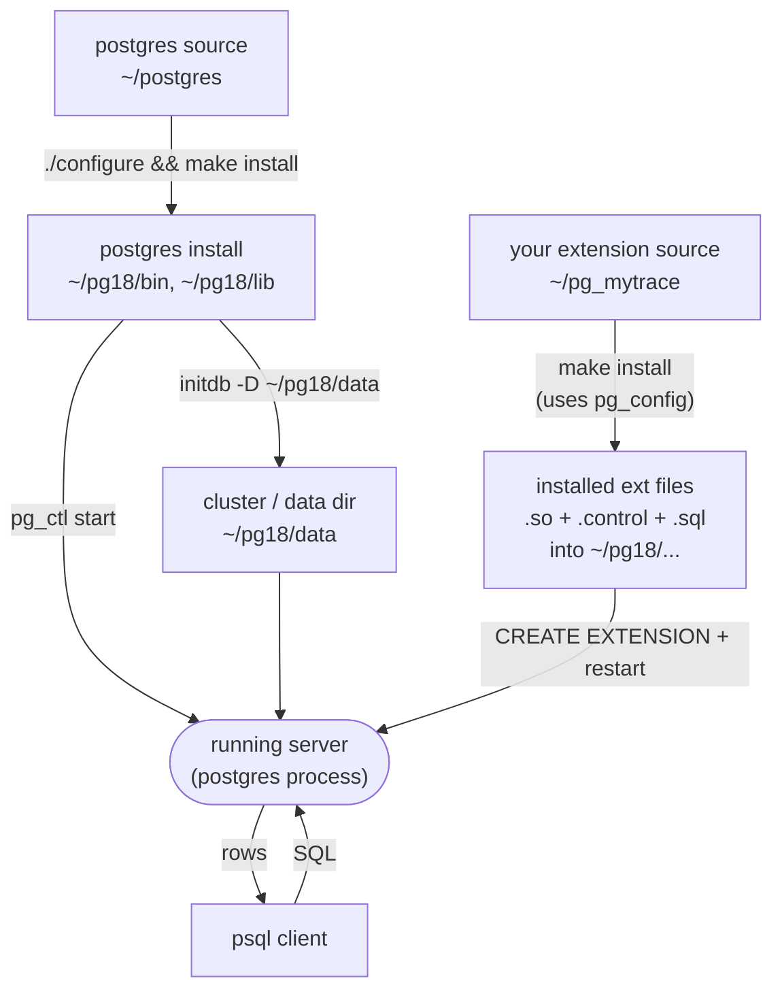
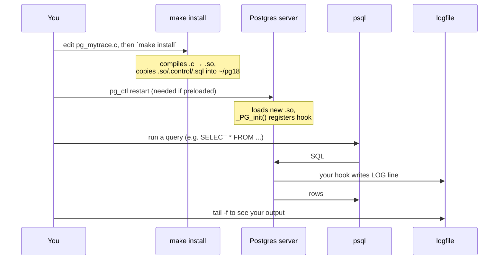
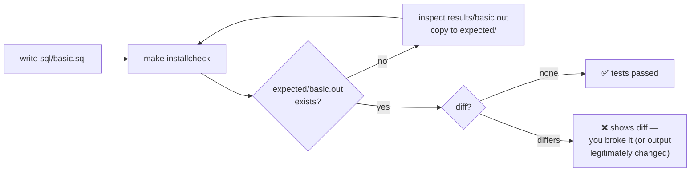
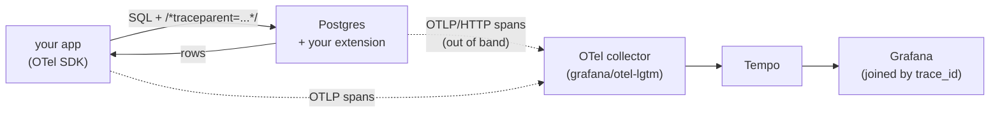

# Building a PostgreSQL Extension — Working Reference

A keep-it-open-beside-your-terminal guide. Covers what each file is, how code
gets into your running Postgres, how to test, and the daily loop. Aimed at the
WSL2 + PG18-from-source + standalone-extension setup.

---

## 1. The mental model: three separate things

The single biggest source of confusion is mushing these together. They are
distinct:

| Thing | Where it lives | What it is |
|---|---|---|
| **Postgres source** | `~/postgres` | The 30M-line C codebase you cloned. You build+install it once, then mostly *read* it. |
| **Postgres install** | `~/pg18` | The compiled binaries + libraries that `make install` produced. This is "your Postgres." |
| **Postgres cluster (data)** | `~/pg18/data` | An actual initialized database directory with your tables, created by `initdb`. The server *runs* this. |
| **Your extension** | `~/pg_mytrace` | Your own tiny repo. Built against the install, loaded into the running server. |

"Install" vs "cluster" trips everyone up: `make install` gives you the
*program*; `initdb` gives you a *database* for that program to serve. You need
both, once each.

---

## 2. How the pieces relate



Key arrow to notice: your extension's `make install` does **not** copy files
into the *source* tree or into the *cluster*. It copies them into the
**install** (`~/pg18`), because that is where the running server looks for
loadable libraries and extension control files. It finds `~/pg18` because your
Makefile asks `pg_config`, and `pg_config` is the one from `~/pg18/bin` on your
PATH.

---

## 3. What each file in your extension is

You have four files. Here is what each one actually does.

### `pg_mytrace.control`
Metadata Postgres reads when someone runs `CREATE EXTENSION pg_mytrace`. Tells
it the default version, where the SQL script is, whether the module must be
preloaded, etc.

```
# pg_mytrace extension
comment = 'Minimal query tracing extension'
default_version = '0.1.0'
module_pathname = '$libdir/pg_mytrace'
relocatable = true
```

`module_pathname` with `$libdir` is how the SQL layer finds your compiled `.so`.

### `pg_mytrace--0.1.0.sql`
The SQL objects your extension creates when installed — functions, views,
tables. The filename pattern `NAME--VERSION.sql` is **mandatory**; Postgres
parses the version out of it. For Rung 0 (a hook that only logs) this can be
nearly empty, because you're not exposing any SQL-callable functions yet:

```sql
-- pg_mytrace--0.1.0.sql
-- Rung 0: no SQL objects yet; the C hook does all the work.
-- This file must exist even if (nearly) empty.
\echo Use "CREATE EXTENSION pg_mytrace" to load this file. \quit
```

Later (Rung 3+) this is where you'd declare e.g.
`CREATE FUNCTION pg_mytrace_dump() RETURNS ... AS '$libdir/pg_mytrace' LANGUAGE C;`

### `src/pg_mytrace.c`
The actual C code. Must contain `PG_MODULE_MAGIC` (a version-stamp macro so
Postgres refuses to load a `.so` built against the wrong major version) and a
`_PG_init()` function that runs when the library loads — that's where you
register your hook.

### `Makefile`
The PGXS build recipe. Tiny, because PGXS supplies all the real rules:

```makefile
MODULE_big = pg_mytrace
OBJS = src/pg_mytrace.o
EXTENSION = pg_mytrace
DATA = pg_mytrace--0.1.0.sql
# REGRESS = basic            # uncomment when you add tests (sql/basic.sql)
PG_CONFIG = pg_config
PGXS := $(shell $(PG_CONFIG) --pgxs)
include $(PGXS)
```

What the variables mean:
- `MODULE_big` — name of the `.so` to build (use this, not `MODULE`, when you
  have multiple `.c` files or `OBJS`).
- `OBJS` — object files to compile and link.
- `EXTENSION` — base name; makes PGXS install the `.control` file.
- `DATA` — the versioned SQL file(s) to install.
- `REGRESS` — test scripts (see §7).
- The `PGXS :=` line asks your installed Postgres where its build rules are.

---

## 4. One-time setup (you may have done some of this)

```bash
# Build & install Postgres (once)
cd ~/postgres
./configure --prefix=$HOME/pg18 --enable-debug --enable-cassert CFLAGS="-O0 -g"
make -j$(nproc)
make install

# Put the install on your PATH (once)
echo 'export PATH=$HOME/pg18/bin:$PATH' >> ~/.bashrc
source ~/.bashrc
pg_config --version          # must say PostgreSQL 18.x

# Create a data directory / cluster (once)
initdb -D ~/pg18/data

# Start the server
pg_ctl -D ~/pg18/data -l ~/pg18/logfile start

# Create a database to play in (once)
createdb playground
```

Sanity check the whole stack is alive:
```bash
psql playground -c "SELECT version();"
```

---

## 5. The daily development loop

This is the rhythm you'll repeat hundreds of times.



As commands:

```bash
cd ~/pg_mytrace
make install                                   # build + install your .so
pg_ctl -D ~/pg18/data restart                  # reload it (see note below)
psql playground -c "SELECT 1;"                  # trigger your hook
tail -n 20 ~/pg18/logfile                       # see your LOG output
```

**When do you need to restart?**
- If your extension is in `shared_preload_libraries` (required for hooks like
  `ExecutorRun_hook` that must be set at startup): **yes, restart every time.**
- If it's a plain `CREATE EXTENSION` with only SQL-callable C functions: a new
  `psql` connection picks up the new `.so`; no full restart needed.

For your tracing project you'll be preloaded, so restart is part of the loop.
To enable preloading, add to `~/pg18/data/postgresql.conf`:
```
shared_preload_libraries = 'pg_mytrace'
```
and restart once. (You still re-run `make install` + restart on every code
change; you only edit `postgresql.conf` the first time.)

**Watch the log live** in a second terminal so you don't keep tailing:
```bash
tail -f ~/pg18/logfile
```

---

## 6. "I changed my extension to do X — now what?" (worked example)

Say you edit the hook to log the query's duration. Concretely:

1. Edit `src/pg_mytrace.c`, save.
2. `make install` — watch for compile errors (they show in VS Code's Problems
   panel via the `$gcc` matcher, and in the terminal).
3. `pg_ctl -D ~/pg18/data restart` — if it fails to start, your new `.so`
   probably crashed `_PG_init()`; check `~/pg18/logfile` for the reason and
   note the server may refuse to start until you fix it.
4. In `psql`, run something that exercises it: `SELECT count(*) FROM big_table;`
5. Look at the log: you should see your new duration line.
6. If you see nothing: is the extension actually preloaded? Check with
   `SHOW shared_preload_libraries;` and `\dx` in psql.

That loop — **edit → make install → restart → query → read log** — is 90% of
the work.

---

## 7. Testing properly with pg_regress

Once a rung works manually, lock it in with a regression test so future changes
can't silently break it.

1. Add to your Makefile: `REGRESS = basic`
2. Create `sql/basic.sql` — the queries to run:
   ```sql
   CREATE EXTENSION pg_mytrace;
   SELECT 1;
   \dx pg_mytrace
   ```
3. Generate the expected output (don't hand-write it):
   ```bash
   make installcheck                 # first run will FAIL (no expected file yet)
   # it writes results/basic.out — inspect it:
   cat results/basic.out
   # if it looks correct, promote it to the golden file:
   mkdir -p expected
   cp results/basic.out expected/basic.out
   ```
4. From now on, `make installcheck` passes if output matches, and shows a diff
   if you broke something. A passing run prints `1 of 1 tests passed`.



Caveat: pg_regress tests that produce *time-dependent* output (durations,
timestamps, span IDs) are fragile — the golden file can't match a random span
ID. Real tracing extensions handle this by normalizing output. For early rungs,
test only stable things (does the extension load? does the function exist?), not
the exact log contents.

---

## 8. Loading a sample schema with data

You asked about Northwind. Honest take: Northwind is a Microsoft/SQL-Server
era schema; it works on Postgres via community ports but isn't the natural
choice here. Three options, easiest first:

**Option A — pgbench (fastest, ships with your build).** Best for your project,
because it makes tables big enough that Postgres chooses a Seq Scan, which is
exactly the plan node you want to see in a span.
```bash
pgbench -i -s 10 playground      # -s 10 ≈ 1M rows in pgbench_accounts
psql playground -c "EXPLAIN SELECT * FROM pgbench_accounts WHERE abalance > 0;"
```

**Option B — a hand-rolled tiny schema (full control).** Good for understanding
joins/plans you design yourself:
```sql
CREATE TABLE customers (id serial PRIMARY KEY, name text);
CREATE TABLE orders (id serial PRIMARY KEY, customer_id int REFERENCES customers, total numeric);
INSERT INTO customers (name) SELECT 'cust_' || g FROM generate_series(1,1000) g;
INSERT INTO orders (customer_id, total)
  SELECT (random()*999+1)::int, (random()*100)::numeric FROM generate_series(1,50000);
ANALYZE;                                  -- so the planner has stats
EXPLAIN SELECT * FROM orders WHERE total > 50;   -- watch the plan
```
`generate_series` is the Postgres-native way to fabricate bulk data — no
external file needed.

**Option C — Pagila / dvdrental (rich, realistic).** Community sample DBs with
many tables, good if you want to practice complex queries. You download a `.sql`
or `.tar` dump and restore it with `psql` or `pg_restore`. Overkill for early
rungs; reach for it later if you want interesting multi-join plans.

Recommendation: **Option A now** (instant, produces seq scans), Option B when
you want to design specific plans, Option C only if you get curious.

---

## 9. Forcing the plan you want to see

To make sure a query *does* a Seq Scan (so your span shows it), you can nudge
the planner per-session:
```sql
SET enable_seqscan = on;
SET enable_indexscan = off;     -- forces seq scans for testing
EXPLAIN (ANALYZE, BUFFERS) SELECT * FROM orders WHERE total > 50;
```
`EXPLAIN ANALYZE` actually runs the query and shows real timings per node —
it's the human-readable version of the span tree you're trying to emit. Study
its output; your extension is essentially turning that tree into OTLP spans.

---

## 10. Essential psql commands

| Command | Does |
|---|---|
| `\dx` | List installed extensions (confirm yours loaded) |
| `\dt` | List tables |
| `\d orders` | Describe a table |
| `\df` | List functions |
| `\timing` | Toggle showing query duration |
| `\x` | Toggle expanded (vertical) output — great for wide rows |
| `\e` | Open the last query in your editor |
| `\i file.sql` | Run a SQL file |
| `\watch 1` | Re-run last query every 1s |
| `\q` | Quit |

Connecting: `psql playground` (a database you made), or `psql -d playground -U
youruser`. Inside, `SELECT pg_backend_pid();` gives the PID to attach a debugger
to (see your launch.json).

---

## 11. Server control cheatsheet

```bash
pg_ctl -D ~/pg18/data start                      # start
pg_ctl -D ~/pg18/data stop                       # stop
pg_ctl -D ~/pg18/data restart                    # restart (your daily friend)
pg_ctl -D ~/pg18/data status                     # is it running?
pg_ctl -D ~/pg18/data reload                     # reload config WITHOUT restart
                                                 # (works for some GUCs, NOT for
                                                 #  shared_preload_libraries)
tail -f ~/pg18/logfile                            # watch logs live
```

If the server won't start after a code change, it's almost always your `.so`
crashing on load — read the tail of `~/pg18/logfile` for the panic/error.

---

## 12. The end-to-end picture (where this is all heading)



Reminder of the architecture you already worked out: context comes **in** via
SQL comment, rows go back **normally**, spans go **out** of band to the
collector, and app+DB spans reunite by `trace_id` in Grafana. Rungs 0–2 don't
touch the collector at all — they just prove the hook fires and can read the
trace context. Only Rung 3 starts exporting.

---

## 13. Suggested first session checklist

1. `pg_config --version` says 18.x. ✅ toolchain wired.
2. Server starts, `psql playground -c "SELECT 1;"` returns a row. ✅ stack alive.
3. `cd contrib/auto_explain && make install`, enable it, run a query, see a
   plan in the log. ✅ you've seen the *category* of thing working.
4. In `~/pg_mytrace`: `make install` succeeds (even if the extension
   does nothing yet). ✅ your build works.
5. Add `shared_preload_libraries = 'pg_mytrace'`, restart, `SHOW
   shared_preload_libraries;` confirms it. ✅ preload works.
6. Make the hook log one line, rebuild, restart, query, see the line. ✅
   **Rung 0 complete.**

After step 6 you have proven the entire loop and everything else is just
writing more C.
